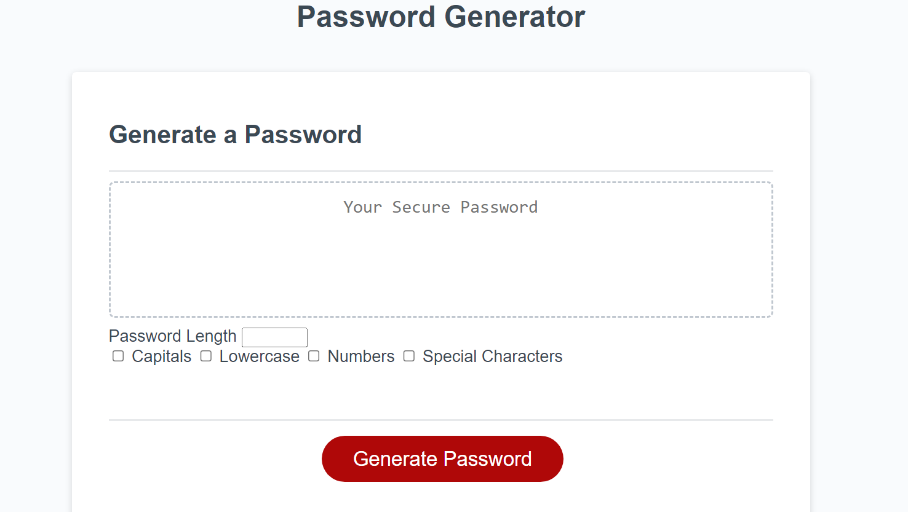

A website containing simple base css and html build which the javascript allows a random password generation including caselock, numbers, and special characters. It features checkboxes and the generate code box, which is also customized by its character length.

The HTML and CSS are starter code, with the addition of checkboxes being added for JS to work with. I added checkboxes of caps, lowercase, special characters, and numbers. I used if statements to associate the checked boxes with the designated randomization and arrays that fit the description. The while input puts into consideration the length the user desires, and the return... .join("") allows the generated password to be combined without issue.
